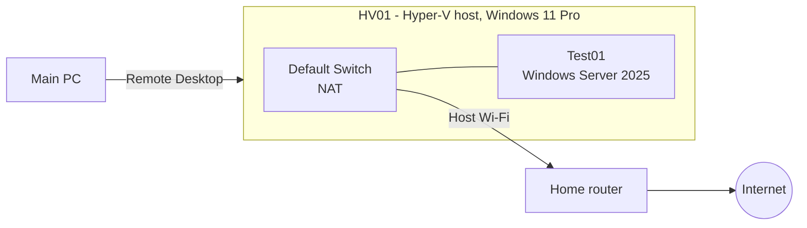

# Chapter 0: Lab foundation

The design of the lab host and the standards every later chapter builds on.

## Purpose

This lab is a virtual environment for practising system and network administration. It will host the servers, clients and network of a fictional 12-person company, Voidline Audio, so I can build, break and fix real services without touching production systems. Chapter 0 covers the host itself: the hardware, the hypervisor, how I manage it, and the rules I follow.

## Hardware

| Part | Detail |
| --- | --- |
| Host | Laptop, hostname `HV01` |
| CPU | Intel Core Ultra 7 165H (16 cores, 22 logical processors) |
| Memory | 32 GB |
| Storage | 1 TB SSD |
| Operating system | Windows 11 Pro |
| Network | Wi-Fi only (no Ethernet port) |

## Design decisions

| Decision | Reason |
| --- | --- |
| Hyper-V as the hypervisor | The laptop is Wi-Fi only. Proxmox needs a wired Ethernet connection for its network bridge, so it was ruled out. Hyper-V is built into Windows 11 Pro and works over Wi-Fi. |
| VMs use the Default Switch for now | It gives a VM internet access through the host using NAT with no setup. Traffic between VMs stays inside the host, so Wi-Fi only carries management and internet traffic. Chapter 1 replaces it with a designed network. |
| Host runs headless with the lid closed, managed over Remote Desktop | The laptop can sit out of the way and I do all the work from my main PC, the same way real servers are managed remotely. |
| Sleep disabled and lid-close set to "do nothing" on mains power only | The host has to stay up for the VMs and Remote Desktop. Battery settings were left alone so the laptop still protects itself when it is unplugged and in a bag. |
| Every VM has a memory maximum (Dynamic Memory) | The host has 32 GB to share. In incident INC-001 a VM set to 49152 MB of static memory could not start at all. A maximum stops one VM from starving the others. |
| Automatic checkpoints turned off | Checkpoints are taken on purpose, before a risky change, with a name that says why. Automatic ones clutter the tree and use disk space. |
| Lab files kept in `C:\Lab\ISO` and `C:\Lab\VMs` | Installation media and virtual machines are separated and easy to find, back up or move. |

## Diagram

## Virtual machines

| Name | Role | Operating system | Generation | Memory | Disk | Network |
| --- | --- | --- | --- | --- | --- | --- |
| `Test01` | Test server | Windows Server 2025 Standard Evaluation (Desktop Experience), build 26100 | 2 | 4096 MB startup, Dynamic Memory 2048 to 4096 MB | 60 GB | Default Switch |

`Test01` has one checkpoint, `Baseline`, taken after the clean-up that followed INC-001.

## Standards

- **Naming:** role plus a two-digit number, for example `HV01`, `Test01`.
- **Memory:** every VM has a maximum set. Servers get at least 2048 MB.
- **Checkpoints:** take one before any risky change and name it for the change. A checkpoint is a point-in-time undo, not a backup.
- **Verification:** a ticket is closed only after checking the result against what the user asked for.
- **Records:** exact values and units are written down as the work happens.
- **Documentation:** every incident gets a report in the [troubleshooting log](troubleshooting.md).

## Next steps

Chapter 1 replaces the Default Switch with a designed network: an OPNsense firewall and separate networks (VLANs) for servers, clients and management.
